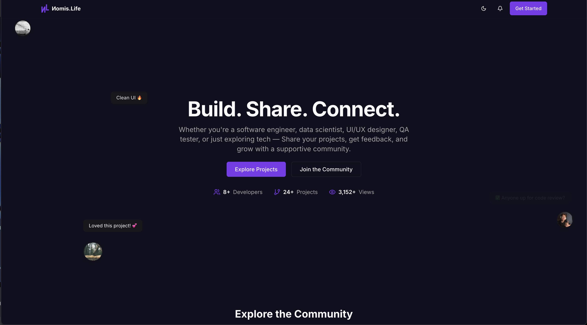

<p align="center">
  
</p>

<p align="center">
  
  
  
  
</p>

<h2 align="center">✨ Nomis.life ✨</h2>

<p align="center">
  Nomis Life is a developer-focused platform where users can showcase their projects, receive feedback, and track skills in a clean, organized way. Built with Next.js, Tailwind CSS, and Appwrite, it supports:

- Public portfolio pages
- Project submission with images, tech stack, and details
- Peer reviews with ratings and comments
- Notifications for project views and feedback
- Skill confidence mapping to identify strengths and gaps
- It’s designed to help developers grow and stand out with real work, not just resumes.
</p>

---

## 🔥 Features

- 🌐 **Customizable Public Portfolio**: Create and manage a professional online presence to showcase your work.
- 🚀 **Project Showcase & Management**: Easily submit projects with detailed descriptions, images, and tech stack information.
- ⭐ **Peer Review & Feedback System**: Receive constructive feedback and ratings from other developers to improve your projects.
- 🔔 **Real-time Notifications**: Stay updated with project views, new feedback, and other important activities.
- 📈 **Skill Confidence Mapping**: Track and visualize your skill development, identifying strengths and areas for growth.
- 🛡️ **Robust Backend with Appwrite**: Leveraging Appwrite for secure and scalable backend services.
- ⚡ **Modern Tech Stack**: Built with Next.js for high performance, Tailwind CSS for sleek UI, and TypeScript for type safety.

---

## 📸 Screenshot

<table align="center">
  <tr>
    <td colspan="2"></td>
  </tr>
  <tr>
    <td></td>
    <td></td>
  </tr>
  <tr>
    <td></td>
    <td></td>
  </tr>
</table>

---

## 🚀 Live Demo

👉 [Visit The Website](https://nomis.life)

---

## 🛠️ Setup & Run

```bash
git clone https://github.com/SawSimonLinn/nomis.life
cd Nomis.life
npm install

npm run dev
```

## 🔑 Environment Variables

To run this project, you will need to add the following environment variables to your .env file:

```
API_KEY=your_api_key_here

```

---

## 💬 Feedback

Feel free to connect with me or drop feedback via [LinkedIn](https://www.linkedin.com/in/sawsimonlinn/). Let’s build something magical together! 💻✨

---

## 📄 License

This project is licensed under the MIT License.
